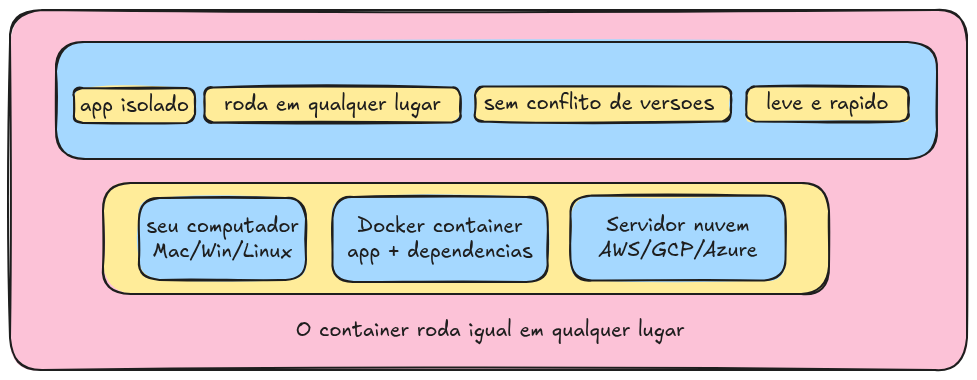
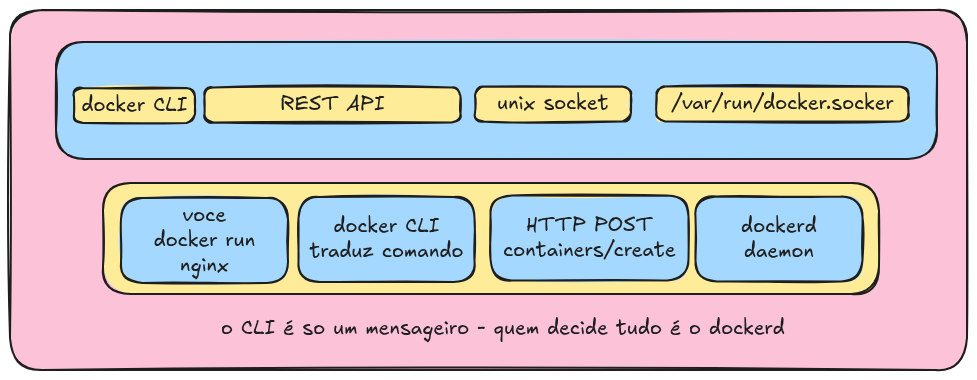
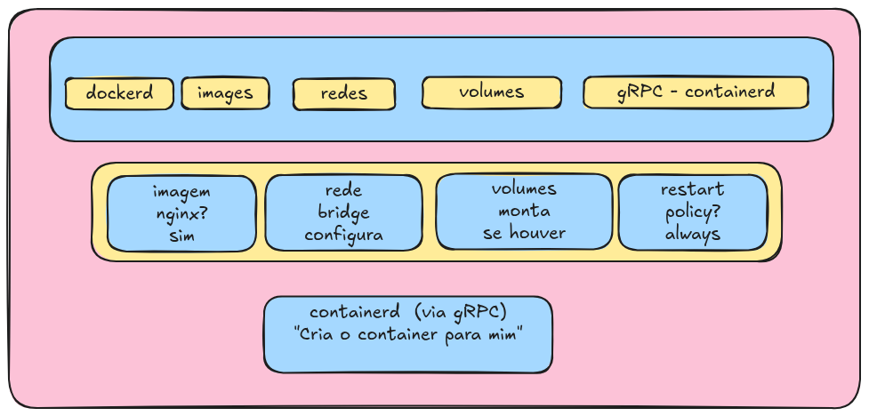
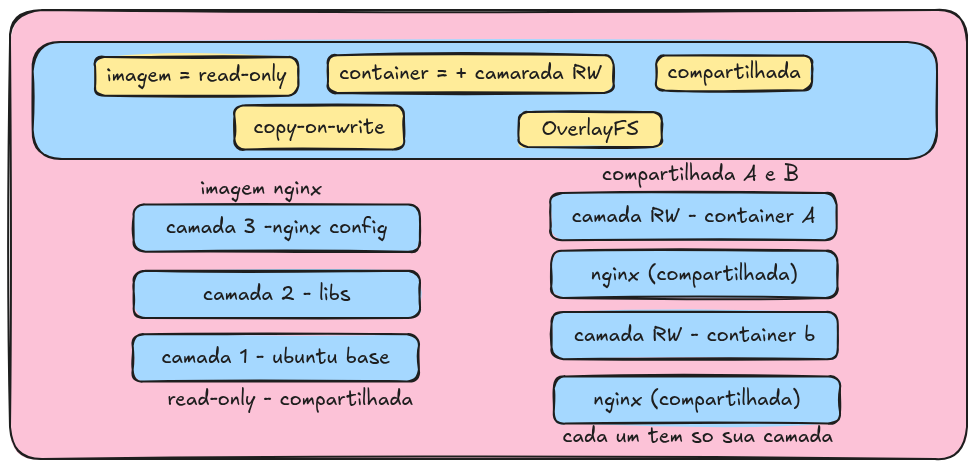

# Docker: caixinha isolada para o seu app

## A grande ideia

**Analogia**

> Pense em um contêiner de navio. Não importa o que há dentro dele: roupas, eletrônicos ou comida. O navio transporta a caixa sem saber o conteúdo.
> O Docker faz o mesmo com o software: empacota o app + tudo o que ele precisa em uma caixa que pode rodar em qualquer lugar.

Sem Docker, um app depende do sistema operacional do servidor. Com Docker, o app leva tudo consigo: bibliotecas, configurações e a versão do Node/Python/Java. Funciona na sua máquina e no servidor do cliente exatamente da mesma forma.

## Passo 1: você digita um comando

### `docker run nginx`

**Analogia**

> Você é o cliente, e o garçom é o Docker CLI. Você faz o pedido: "Quero um Nginx". O garçom não cozinha; ele só anota o pedido e o manda para a cozinha.

O `Docker CLI` é só um programa que traduz seu comando em uma chamada HTTP e a envia para o `dockerd` (o daemon). Ele não faz nada sozinho.

## Passo 2: o daemon gerencia tudo

### `dockerd`: o gerente da cozinha

**Analogia**

> O Docker é o gerente da cozinha. Ele cuida das imagens, baixa o que falta, organiza redes, volumes e a política de reinício dos containers. Mas ele não cria o container diretamente: ele organiza tudo e delega essa parte para outra pessoa, o `containerd`.

O `dockerd` é o cérebro do Docker. Ele gerencia imagens, redes, volumes e políticas de reinício dos containers. Mas ele não cria o container diretamente: manda o `containerd` fazer isso via gRPC.

## Passo 3: a imagem e as camadas

### Imagem = receita; container = prato pronto

**Analogia**

> Uma imagem Docker é como uma receita de bolo. Você pode fazer 10 bolos com a mesma receita; cada bolo seria um container. A receita não muda, mas cada bolo é independente.

Uma imagem é feita de camadas empilhadas (`OverlayFS`). As camadas da imagem são somente leitura (`read-only`) e compartilhadas entre todos os containers. Cada container recebe apenas uma camada própria de escrita (`read-write`) no topo. Isso economiza muito espaço em disco.

