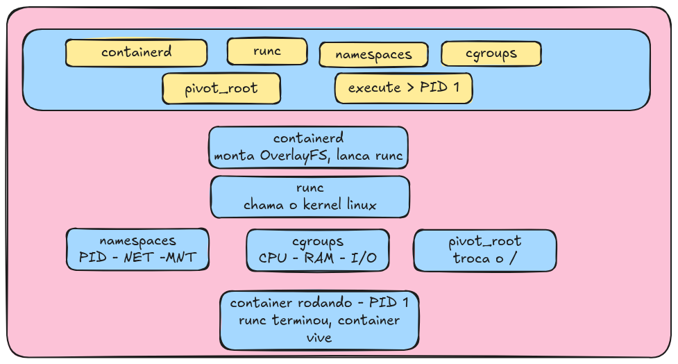
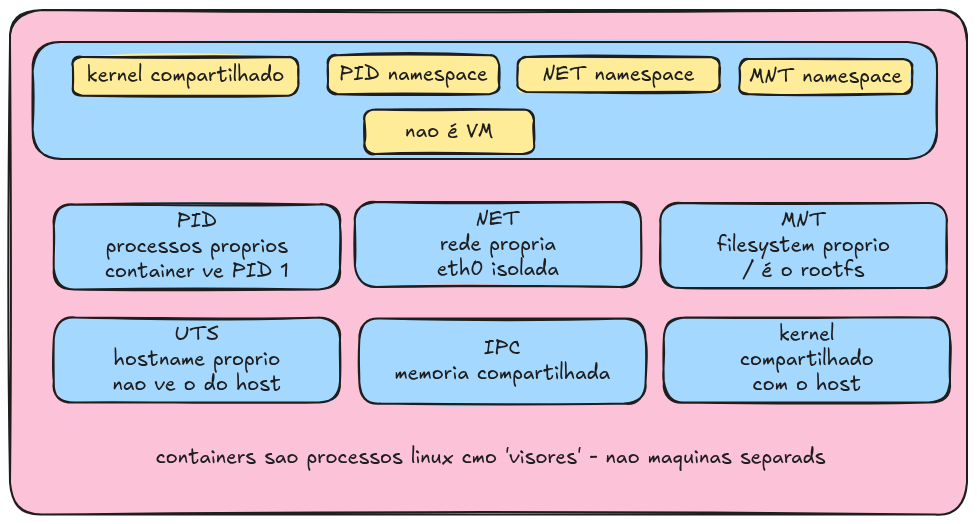
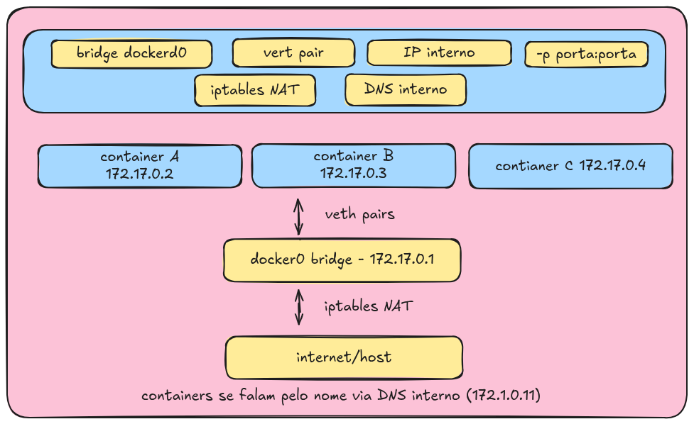

# Docker: caixinha isolada para o seu app

## A grande ideia

**Analogia**

> Pense em um contêiner de navio. Não importa o que há dentro dele: roupas, eletrônicos ou comida. O navio transporta a caixa sem saber o conteúdo.
> O Docker faz o mesmo com o software: empacota o app + tudo o que ele precisa em uma caixa que pode rodar em qualquer lugar.

Sem Docker, um app depende do sistema operacional do servidor. Com Docker, o app leva tudo consigo: bibliotecas, configurações e a versão do Node/Python/Java. Funciona na sua máquina e no servidor do cliente exatamente da mesma forma.

## Passo 1: você digita um comando

### `docker run nginx`

**Analogia**

> Você é o cliente, e o garçom é o Docker CLI. Você faz o pedido: "Quero um Nginx". O garçom não cozinha; ele só anota o pedido e o manda para a cozinha.

O `Docker CLI` é só um programa que traduz seu comando em uma chamada HTTP e a envia para o `dockerd` (o daemon). Ele não faz nada sozinho.

## Passo 2: o daemon gerencia tudo

### `dockerd`: o gerente da cozinha

**Analogia**

> O Docker é o gerente da cozinha. Ele cuida das imagens, baixa o que falta, organiza redes, volumes e a política de reinício dos containers. Mas ele não cria o container diretamente: ele organiza tudo e delega essa parte para outra pessoa, o `containerd`.

O `dockerd` é o cérebro do Docker. Ele gerencia imagens, redes, volumes e políticas de reinício dos containers. Mas ele não cria o container diretamente: manda o `containerd` fazer isso via gRPC.

## Passo 3: a imagem e as camadas

### Imagem = receita; container = prato pronto

**Analogia**

> Uma imagem Docker é como uma receita de bolo. Você pode fazer 10 bolos com a mesma receita; cada bolo seria um container. A receita não muda, mas cada bolo é independente.

Uma imagem é feita de camadas empilhadas (`OverlayFS`). As camadas da imagem são somente leitura (`read-only`) e compartilhadas entre todos os containers. Cada container recebe apenas uma camada própria de escrita (`read-write`) no topo. Isso economiza muito espaço em disco.

## Passo 4: criando o container de verdade

### `containerd` + `runc`: a cozinha real

**Analogia**

> O `containerd` é o cozinheiro-chefe que organiza tudo. O `runc` é o sous-chef que executa a tarefa específica de montar o prato. Depois que o prato está na mesa, o sous-chef vai embora; só o prato fica.

O `containerd` monta o sistema de arquivos (`OverlayFS`) e inicia o `runc`. O `runc` usa o kernel Linux para criar o isolamento real: `namespaces` (o container acredita estar em uma máquina isolada) e `cgroups` (limites de CPU e memória). Depois que o processo inicia, o `runc` termina; o container continua rodando sem ele.

## Passo 5: isolamento do kernel

### `namespaces`: o container acha que está sozinho

**Analogia**

> `Namespaces` são como óculos com lentes diferentes. O container coloca esses óculos e enxerga apenas os próprios processos, a própria rede e os próprios arquivos. Ele não vê o host nem os outros containers. Mas, por baixo, o kernel continua sendo o mesmo.

O kernel Linux não é duplicado; ele é compartilhado com o host, diferente de uma máquina virtual. O que muda é a visão que cada processo tem do sistema. Cada `namespace` cria uma visão isolada.

- `PID namespace`: o container tem seu próprio PID 1.
- `Net namespace`: o container tem sua própria interface de rede.
- `Mount namespace`: o container tem sua própria árvore de arquivos.

## Passo 6: rede entre containers

### `bridge`, `veth` e publicação de portas

**Analogia**

> Cada container é uma casa em um condomínio. A rede `docker0` é a rua interna que conecta as casas. Para sair para a internet, o tráfego passa pela portaria (`NAT`/`iptables`). Para receber visitas de fora, você abre um portão específico, como `-p 8080:80`.

Por padrão, o Docker cria uma bridge virtual chamada `docker0`. Cada container recebe uma interface de rede virtual (`veth pair`) conectada a essa bridge. Containers na mesma rede conseguem se comunicar por IP e, em redes de usuário, também por nome de serviço.

Quando você publica uma porta com `-p 8080:80`, o Docker configura regras de `iptables` para redirecionar o tráfego da porta `8080` do host para a porta `80` do container.

## Fluxo completo

### `docker run nginx`: tudo junto

**Resumo mental**

Você pede -> CLI avisa o daemon -> daemon busca a imagem -> `containerd` monta o filesystem em camadas -> `runc` pede ao kernel para criar o isolamento -> o container nasce com sua própria rede.

Agora você conhece cada peça. A chave é: containers não são VMs; são processos Linux com visão restrita. O kernel é compartilhado, o filesystem é em camadas e a rede é virtual por cima do kernel. Tudo isso junto faz o container ser mais leve e rápido para iniciar do que uma VM.

